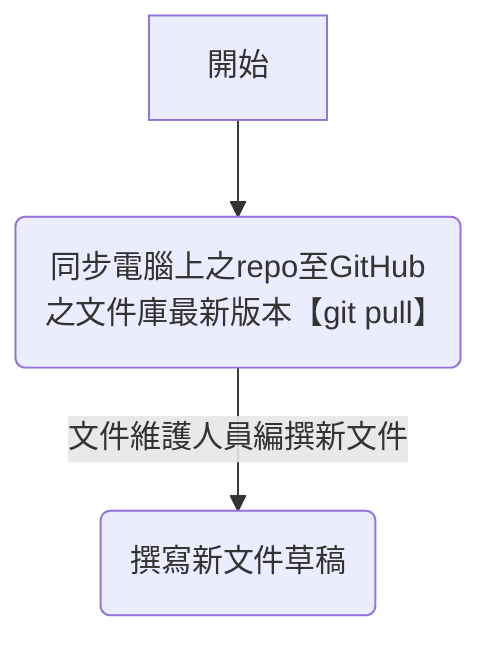
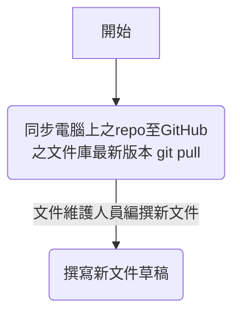

## Buggy mermaid

```mermaid
graph TD;
  A[開始] -->|文件維護人員編撰新文件| C(撰寫新文件草稿);
  B[開始] -->| | A(同步電腦上之repo至GitHub之文件庫最新版本【git pull】);
```

## Normal mermaid

```mermaid
graph TD;
  A[開始] -->|文件維護人員編撰新文件| C(撰寫新文件草稿);
  B[開始] -->| | A(同步電腦上之repo至GitHub之文件庫最新版本 git pull);
```
